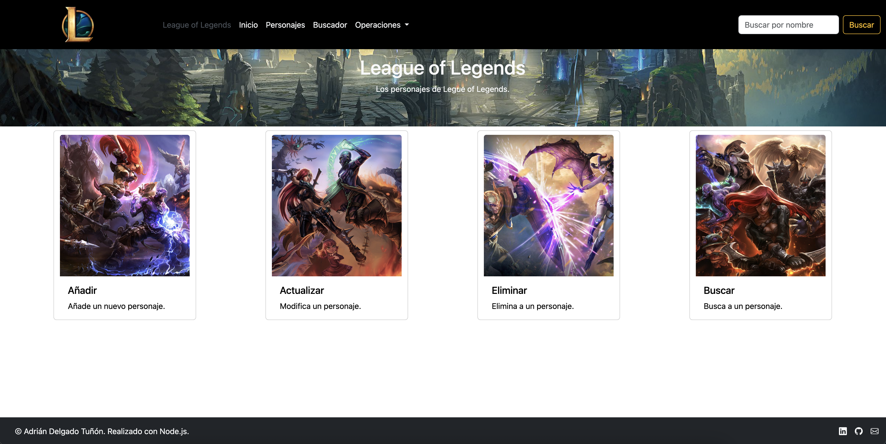
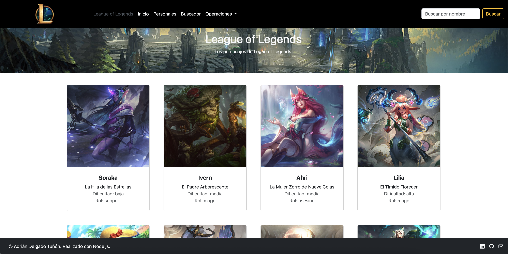
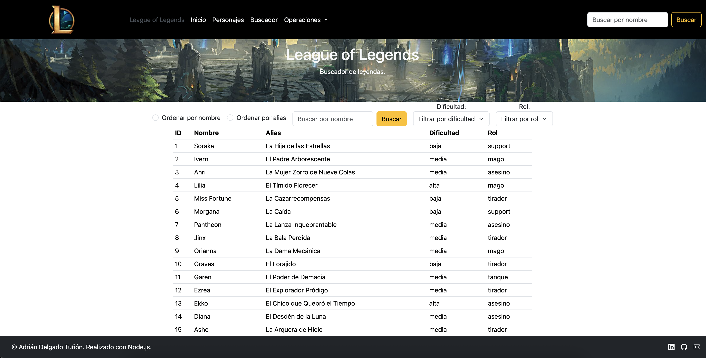
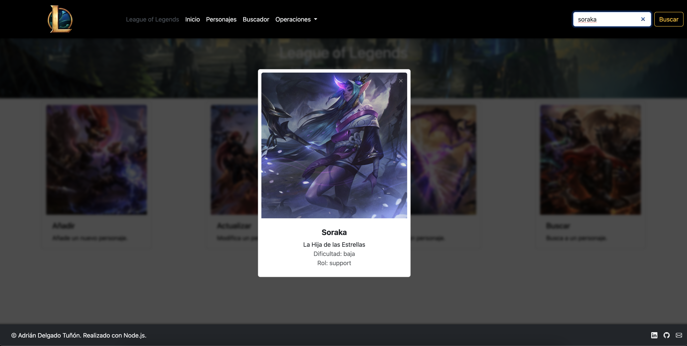
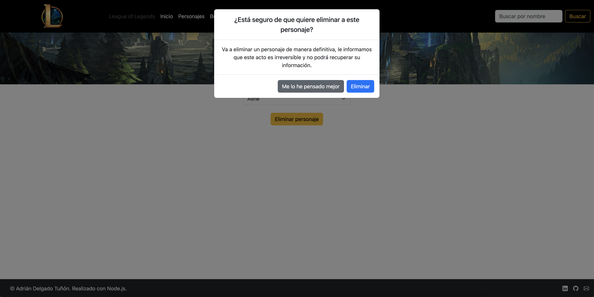

```markdown
# League of Legends Character Manager 🎮

Aplicación web desarrollada con **Node.js y Express** para gestionar personajes de
League of Legends mediante un sistema CRUD completo. La información se almacena en
un archivo **JSON** y permite operaciones dinámicas desde una interfaz intuitiva.

---

## 🚀 Características Principales

✅ **Gestión de Personajes**  
   - Crear, eliminar y editar personajes.  
   - Ver lista completa de personajes con tarjetas informativas.  

🔍 **Filtrado y Búsqueda**  
   - Filtrar por **rol** (ej: "Mago", "Tirador") o **dificultad** (bajo-media-alta).  
   - Ordenar alfabéticamente (A-Z o Z-A).  
   - Buscador global en la barra de navegación:  
     - Búsqueda **insensible a mayúsculas/minúsculas**.  
     - Muestra resultados en tiempo real mientras escribes.  

🗃️ **Estructura de Datos**  
   Cada personaje tiene:  
   ```json
   {
     "id": "1",
     "nombre": "Ahri",
     "alias": "La Raposa de Nueve Colas",
     "dificultad": "medio",
     "rol": "mago"
   }
   ```

---

## 🛠️ Tecnologías Utilizadas

- **Backend**: Node.js + Express.js  
- **Frontend**: HTML5, CSS3, JavaScript (Vanilla)  
- **Almacenamiento**: Archivo JSON (`src/personajes.json`)  
- **Métodos HTTP**: GET, POST, PUT, DELETE  

---
## 📸 Capturas de Pantalla

### Vista Principal


### Visualización de Personajes


### Búsqueda de personajes


### Buscador en navegación


### Eliminar personaje



## 💻 Despliegue
   Visita el siguiente enlace: https://league-of-legends-personajes.koyeb.app/
   
---

## 📦 Instalación

1. Clona el repositorio:  
   ```bash
   git clone https://github.com/Adrian-DT/League-Of-Legends_Personajes.git
   ```

2. Instala dependencias:  
   ```bash
   npm install
   ```

3. Inicia el servidor:  
   ```bash
   npm start
   ```

4. Accede a la app en:  
   [http://localhost:3000](http://localhost:3000)

---

## 📖 Uso Básico

1. **Añadir Personaje**  
   - Ve a **/anadir** y completa el formulario.  
   - ¡Automáticamente se añadirá a `personajes.json`!

2. **Filtrar por Rol**  
   - Selecciona un rol en el menú desplegable.
     
3. **Filtrar por Dificultad**  
   - Selecciona una dificultad en el menú desplegable.

4. **Buscar Personaje**  
   - Escribe en el campo de búsqueda (ej: "lux" o "Lux")  
   - Verás tarjetas con los resultados coincidentes.
     
---

## 📝 Contribuciones

1. Fork del repositorio.  
2. Crea una rama: `git checkout -b nueva-funcionalidad`.  
3. Sube tus cambios: `git commit -am "Mejora: descripción"`  
4. Enviar Pull Request.

---

**¡Crea, edita y domina a tus personajes de LoL favoritos!** 🏆  
_Creado con ❤️ para la comunidad de League of Legends._
``` 
